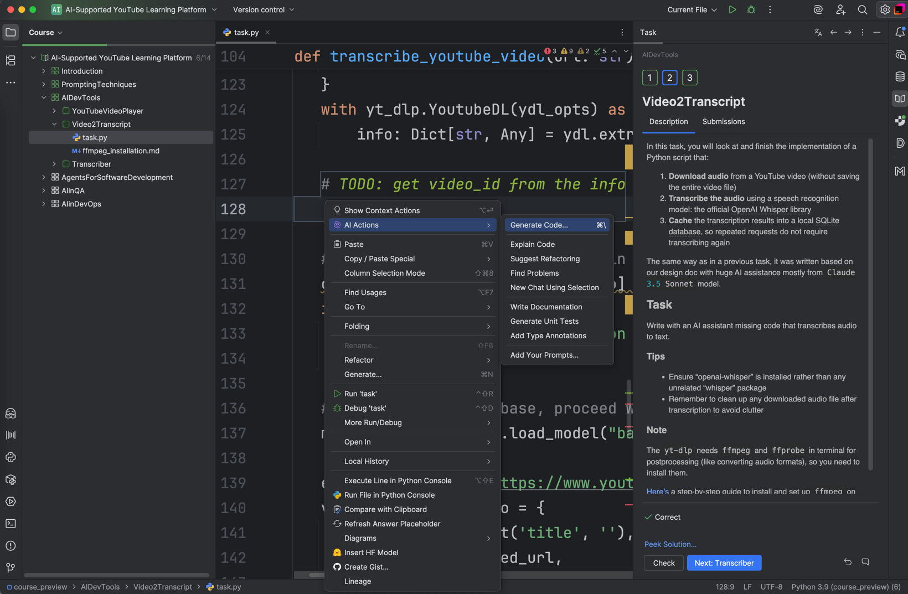

In this task, you'll complete the implementation of a Python script that does the following:

1. **Downloads audio** from a YouTube video (without downloading the entire video file)
2. **Transcribes the audio** using OpenAI's Whisper speech recognition library  
3. **Caches the transcription results** in a local SQLite database, so repeated requests don't require reprocessing

The base code was generated with assistance from the`Claude 3.5 Sonnet` model, 
based on the design document from the previous lesson.

## **Task**

Complete the missing code for audio transcription with the help of the AI Assistant.

  If stuck, you can ask AI to generate code for you:
  

### **Tips**

* Make sure you have `openai-whisper` installed rather than an unrelated "whisper" package.  
* Remember to clean up any downloaded audio files after transcription to keep your workspace tidy.

### **Note**

The `yt-dlp` tool requires `ffmpeg` and `ffprobe` for audio post-processing (e.g. converting audio formats). 
If you haven't already, install them before running the app.

Here's a [step-by-step guide](file://AIDevTools/Video2Transcript/ffmpeg_installation.md) to install 
and set up `ffmpeg` on Windows and Mac/Linux.
