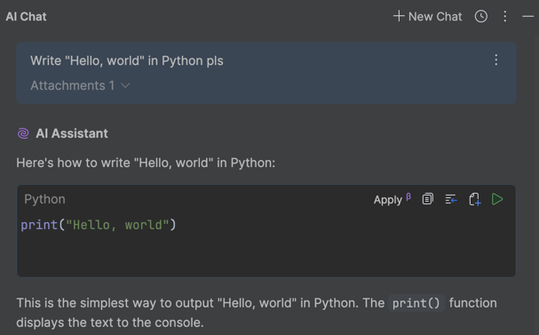
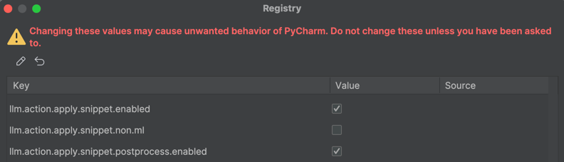

# Enabling Smart Apply in PyCharm

Smart Apply is a powerful feature in PyCharm that allows you to quickly apply AI-suggested code changes with a single action. This guide will walk you through the process of enabling and using Smart Apply in PyCharm.

## Prerequisites

- PyCharm IDE
- AI Assistant plugin installed and configured

## Using Smart Apply

Once enabled, you can use Smart Apply in Snippets of AI Assistant:

## Steps to Enable Smart Apply (if not yet)

### 1. Open Find Action Menu

- **Windows/Linux**: `Ctrl + Shift + A`
- **macOS**: `Cmd + Shift + A`

### 2. Navigate to Registry (with caution!)

### 3. Enable Smart Apply

- Look for the "llm.action.apply.snippet.enabled" option
- Set its checkbox to enable

## Troubleshooting

If Smart Apply is not working as expected:

1. Ensure the AI Assistant plugin is up to date
2. Verify that Smart Apply is enabled in the settings
3. Restart PyCharm if necessary
