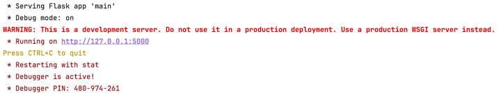

In this task, you'll start developing the webpage for your learning platform — specifically, 
the YouTube video player. Before you begin, complete the "AI Development Tools" 
course and read the guide on [enabling Smart Apply](file://AIDevTools/YouTubeVideoPlayer/EnableSmartApply.md) in PyCharm if you don't have `Apply` button at the top of code snippets from AI Assistant.

Also take a look at the video [Task 2: AI Development Tools](https://www.youtube.com/watch?v=ZnDM9I2VhCo) to learn more about 
the current functionality of the app, you need to implement.

Once you're ready, read through the functionality description below and then complete the tasks. 
This is just the starting point — you'll improve the app throughout the course by adding structure and new functionality.

## **Functionality description**

In this task, you'll work with a basic webpage that allows users to play a YouTube video by pasting a URL 
and choosing a start time. The initial code was mostly written by the AI Assistant with `Claude 3.5 Sonnet` API.

### **Key functionality**

1. **Video URL input:** A text box where users can paste the full YouTube video link.  
2. **Start time input:** A numeric input field that sets the starting time of the video in seconds.  
3. **Embedded video player:** An `<iframe>` that embeds YouTube videos. The code dynamically updates the `src` attribute of the iframe to load the requested video.

### **Implementation**

* **HTML forms and inputs:** The HTML code [./templates/index.html](file://AIDevTools/YouTubeVideoPlayer/templates/index.html) includes CSS styles, forms (`<form>`, `<input>`, `<button>`), and JavaScript code to collect user input.  
* **JavaScript DOM manipulation:** JavaScript code captures the video URL and start time and updates the iframe's `src` to load and play the chosen video.  
* **URL parsing:** The JavaScript code parses the YouTube URL to extract the video ID, which is a unique identifier for each video on YouTube. It handles several different YouTube URL formats.  
* **Query parameters:** YouTube URLs often use query parameters (the part after the `?`) to specify options like the start time (`t` parameter). The code handles these query parameters to start the video at the correct time and automatically plays the video via the `autoplay=1` parameter.

## **Task**

1. Replace the default YouTube video with one of your favorites in [./templates/index.html](file://AIDevTools/YouTubeVideoPlayer/templates/index.html) and [./main.py](file://AIDevTools/YouTubeVideoPlayer/main.py).  
2. Ask the AI Assistant to generate nice styles in [./templates/index.html](file://AIDevTools/YouTubeVideoPlayer/templates/index.html).  
3. Run [./main.py](file://AIDevTools/YouTubeVideoPlayer/main.py) by pushing &shortcut:Run; in PyCharm and then clicking on the URL from the console (e.g. [http://127.0.0.1:5000](http://127.0.0.1:5000)). Check that everything works as expected.

