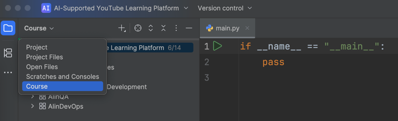

**Welcome to the Capstone Project: Building an AI-Supported YouTube Learning Platform!**

In this project, you'll create a YouTube-based learning platform where users can view videos, 
generate timestamped transcripts, and complete quiz tasks. 
You'll develop this application with the help of AI, applying the skills you've gained throughout 
the course: prompt engineering, AI-assisted coding, agentic programming, 
debugging and testing with AI, and deploying with security and privacy in mind.

By completing this project, you'll gain hands-on experience using AI as a collaborative development partner, 
from early planning to final deployment.
Watch this two videos for an overview of the project and first steps:
 - [Introduction: What You Will Do](https://www.youtube.com/watch?v=8t1BO7Xw3vs)
 - [First Steps: How to Start Your Project](https://www.youtube.com/watch?v=01EFfCIsIa0)

The project consists of five lessons, each aligned with a course topic:

1. Prompting Techniques

In the first lesson, you'll create technical documentation for the app, 
including the project structure, architecture, and AI integration points. 
An LLM will evaluate your final Markdown document for clarity, feasibility, 
and effectiveness of AI integration proposals.

2. AI Development Tools

You'll then implement a Python script that downloads audio from YouTube videos, 
transcribes it using the OpenAI Whisper library, and stores the results in a local SQLite database. 
You'll also begin developing the platform by completing the code 
for a simple webpage with a YouTube video player.

3. Agents for Software Development

Here, you'll complete a web application module that transforms YouTube videos 
into structured course content. You'll also use the coding agent Junie in PyCharm 
to implement quiz generation based on topics and difficulty levels defined by admins.

4. AI in QA Engineering

In this lesson, you'll review test files written by Junie. 
Your task is to identify and fix bugs in these tests, which will help you recognize 
common flaws and patterns in AI-generated code.

5. AI in DevOps

Finally, you'll review a deployment plan created by an AI assistant, 
correct errors, and set up the project locally using Docker.

### Getting started
<aside> 📌
To access the project, download the <a href="https://plugins.jetbrains.com/plugin/27081-ai-supported-youtube-learning-platform">plugin-course</a>. 
All tasks will be available inside PyCharm, so make sure it's installed on your machine.
</aside>

The project relies on several key libraries:

- **yt-dlp**: Extracts and downloads audio from YouTube videos.
- **Flask**: Powers the web application.
- **openai-whisper**: Transcribes audio to text. 
- **torch**: Supports deep learning functionality.
- **transformers**: Enables advanced NLP tasks and AI model integration.
- **python-dotenv**: Manages environment variables for secure configuration.
- **pytest**: Provides tools for automated testing.
- **gunicorn**: Serves as a production-grade WSGI HTTP Server.

Please install all the required libraries using PyCharm's built-in helper
or by running the following command in the terminal:
`pip install -r requirements.txt`.

### One more thing
If you want to see all the files and, for example, the `.env` file you created with environment variables, 
switch to the `Project Files` tab at the top of project structure:

