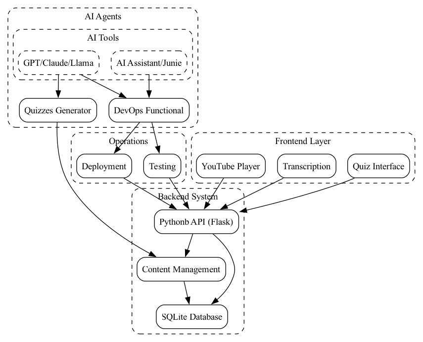

## **1\. Project Setup & Requirements**

### **Core Features**

* **User workflows**: Watching YouTube videos, generating transcripts, and taking quizzes.  
* **Administrative workflows**: Managing transcripts and quiz content.

### **Tech Stack**

* **Backend & Frontend**: Python (Flask)  
* **Database**: SQLite for storing video content and quiz data  
* **AI Tools**:  
  * IDE-based AI assistant for coding tasks  
  * LLMs (GPT, Claude, Llama) for general tasks and additional testing

### **AI-Driven Features**

* **Quiz Designer**: Automatically creates questions from video transcripts.  
* **DevOps Functionality**: Supports deployment and monitoring tasks.

## **2\. Architecture & Data Modeling**

### **High-Level Architecture**

* **Client Layer**: Web interface for user interaction.  
* **API Gateway**: A Python-based backend that exposes REST endpoints.  
* **Database**: Stores course materials, transcripts, and quizzes.  
* **AI Integration Layer**: Microservices or scripts that communicate with LLMs for content and quiz generation or analytics.

### **Data Models**

* **Transcriptions**: `video_id`, `title`, `embed_url`, `duration`, `transcript`, `created_at`  
* **Modules**: `video_id`, `modules[]`, `created_at`  
* **Quizzes**: `video_id`, `module_tile`, `difficulty`, `questions[]`

### **AI Content Generation Workflow**

* User triggers the Quiz Designer  
* AI generates a set of quiz questions  
* Admin reviews AI-generated content before publishing to the platform (human-in-the-loop)  
* DevOps Functionality supports deployment and ensures service health

## **3\. Implementation with AI Assistance**

### **Project Scaffolding**

Start from a pre-created structure:

* Basic file structure (frontend \+ backend)  
* Initial routes (e.g. `/watch`)  
* Database schema setup

### **Course & Quiz Modules**

* **Course Creation**:  
  * AI assistant and Junie in PyCharm create the database and table models.  
  * Example prompt: "Generate a REST API controller in Python for creating, reading, updating, and deleting courses with associated modules."  
* **Quiz Generation**:  
  * Integrate the Quiz Generator to suggest quiz questions.  
  * Admins provide the transcript and difficulty level → AI returns formatted questions and answers.

## **4\. Course Administration**

### **Quiz Designer**

* **Input**: YouTube video transcript, complexity level.  
* **Output**: Quiz questions in JSON format.  
* **Feedback & Iteration**: Admin reviews AI suggestions → modifies prompts to refine content.

### **DevOps Functionality**

* **Deployment**: Creating pipelines for deployment and logging.  
* **Integration with the QA Pipeline**: Running tests (e.g. pytest files) before building a production version.

## **5\. Testing & Quality Assurance with AI**

### **Unit & Integration Tests**

* **AI-Suggested Test Cases**:  
  * Prompt example: "Generate a pytest suite for verifying quiz creation."  
  * Evaluate coverage, refine prompts if coverage is lacking.  
* **Automated Testing Tools**:  
  * Use the IDE-based AI assistant to fill out boilerplate test code.  
  * Incorporate AI suggestions for edge cases.

### **Debugging Workflows**

* **LLM-Aided Bug Fixes**  
  * Prompt Example: "There's a concurrency issue in the result submission process. Help me identify possible race conditions and suggest code changes."  
  * Step-by-step solutions to systematically isolate and fix issues.

## **6\. Deployment**

### **AI-Powered Deployment Pipeline**

1. **CI (Continuous Integration)**  
   * Use GitHub Actions or GitLab CI with automatic test runs and code coverage reports.  
   * Use an AI Agent to read logs and suggest fixes for failing builds.  
2. **CD (Continuous Delivery)**  
   * Containerize the app with Docker and deploy it to a cloud platform (Nebius, AWS, GCP, Azure).  
   * Use ChatGPT or Copilot to write Dockerfiles, Kubernetes manifests, or Terraform scripts.

### **Security & Privacy Considerations**

* **Content Reliability & Bias**  
  * Provide disclaimers that quiz questions are AI-generated and may contain inaccuracies.  
  * Include a human review step to mitigate inappropriate or low-quality AI output.  
* **Legal Considerations**  
  * If using third-party LLMs, ensure compliance with their terms (especially for internal dev environments).  
  * Document how AI-generated content is licensed and disclaim responsibility for any errors in quiz materials.

## **7\. Final Integration & Launch**

* **Functional Review**  
  * Perform an end-to-end user flow test: transcribe a video, take a quiz, and check the results.  
* **Performance & Load Testing**  
  * If expecting higher usage, conduct performance tests.  
  * AI can help generate scripts for load testing.  
* **Production Launch**  
  * Deploy to the production environment.  
  * Monitor logs and user feedback; iterate and refine based on real-world usage.  
  * Continue to use the AI pipeline for bug fixes, new feature suggestions, and content updates.
